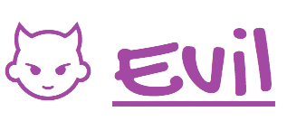

CSS MADE EASIER, SYNTACTICALLY CLEANER AND MORE READABLE!

Evil is a minimalistic stylesheet language that can be easily converted to CSS. It lets you write CSS with a cleaner and more readable syntax. With Evil, you can do more with less typing. Its syntax doesn't use things such as semicolons and brackets: they aren't necessary, because they'll be added automatically when Evil code is converted to CSS. To convert Evil into usable CSS, just execute the Evil CLI by typing `ruby evil.rb` and then typing the name of the file (with the .evil extension) to be converted. Evil will automatically generate a file with the .css extension for you.
